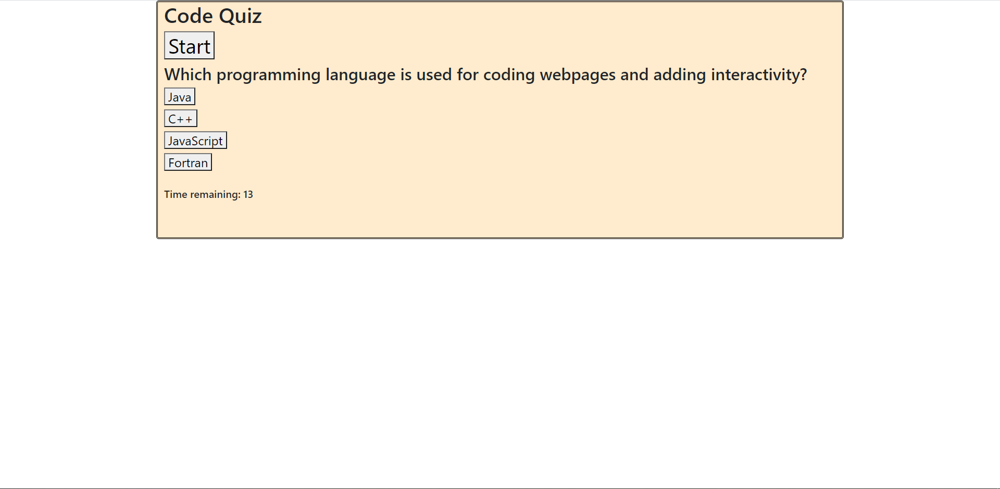

Deployed at: https://gsonnier333.github.io/code-quiz/

For this assignment, I created a web page that can use JavaScript to give the user a multiple choice quiz, followed by a score based on how well they did. When the user presses the Start button, they are given a question and four options for answers. When they click on an incorrect answer, the time they have remaining for the quiz is lowered, and they have to try again to click the correct answer. When they do click the correct answer, they are given the next question in the quiz along with new options for answers. If they complete the quiz by answering all of the questions correctly before time runs out, they win, and are given a score equal to the number of seconds remaining in the quiz when they finished. They are then prompted to enter their initials to save their score, which is added to a list of previous scores and initials. That list is displayed underneath the quiz, and should remain displayed as long as there are scores stored in local storage. If the user cancels the prompt or enters an empty string, their score is omitted from the list.

When I set out to work on this assignment, I decided to try and code it using JQuery in order to get practice using the library. Doing this helped to cement important methods and syntax from JQuery in my mind. Apart from JQuery, this assignment also helped me grow more comfortable using local storage to handle objects (as opposed to just Strings), and it helped me better wrap my head around how to write code for a webpage to facilitate smooth interaction with the user. One big thing I've learned from doing this is to avoid using loops or intervals to wait for and check input, but instead to call the appropriate functions in response to the input events themselves.
